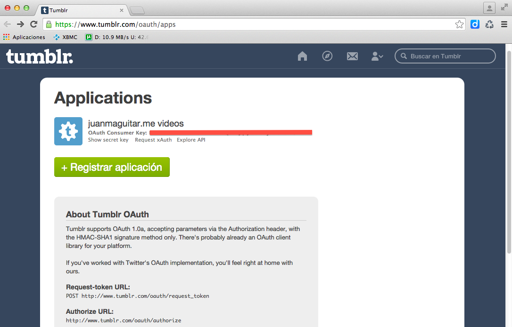
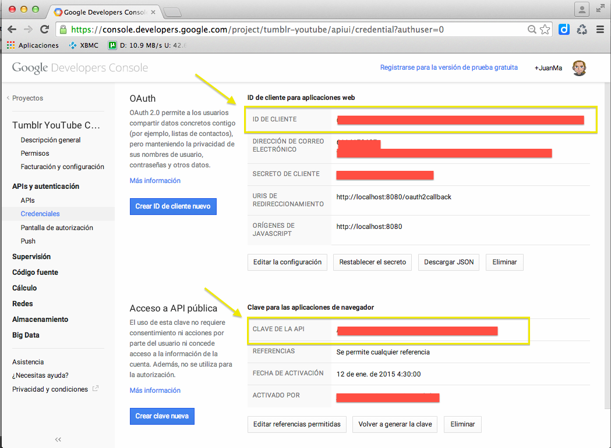
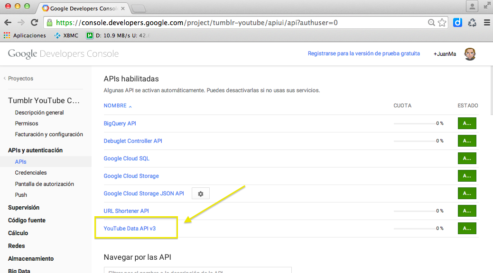
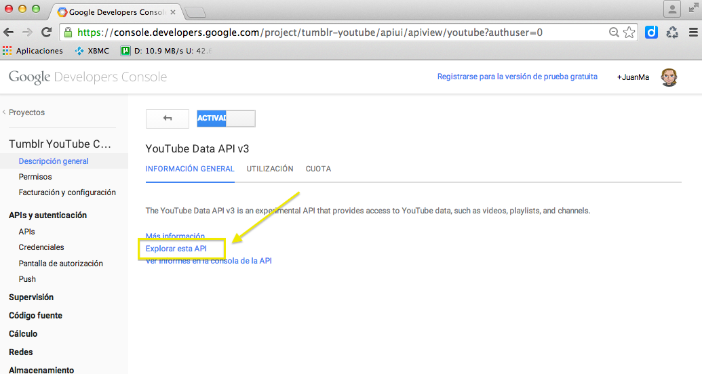
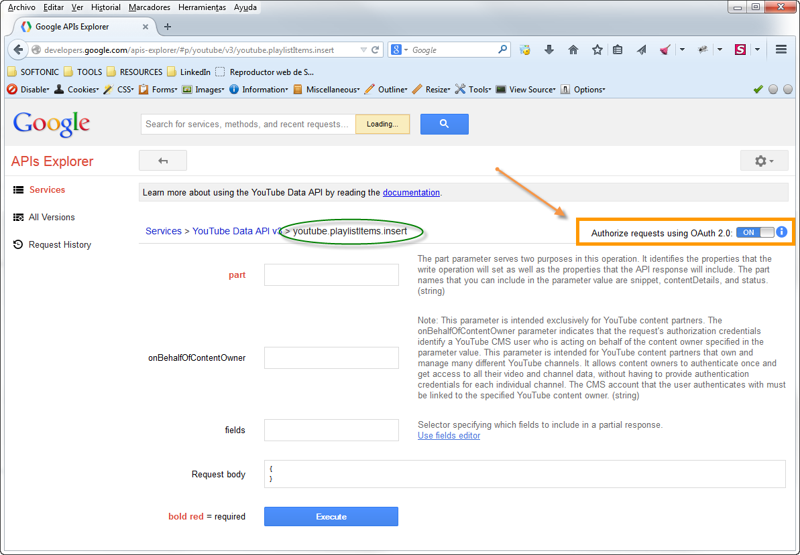

#Tumblr YouTube Connection

This project do the following:

- Connects to a Tumblr Site and gets all the YouTube Videos
- Creates a YouTube playlist w/ all these videos found

##Install

After cloning the repository, you must launch [`npm`](https://docs.npmjs.com/getting-started/what-is-npm) & [`bower`](http://bower.io/) installers and execute [`grunt`](http://gruntjs.com/)

    $ git clone https://github.com/juanmaguitar/youtumblr.git
    $ cd youtumblr
    $ npm install
    $ bower install
    $ grunt

_Check [these solutions](http://stackoverflow.com/questions/23042166/grunt-contrib-sass-not-working-with-compass) if you find problems w/ compass_

##Setup

To have it fully working (interacting properly w/ Tumblr and YouTube API's) you have to edit:

- the file `www/src/js/config.local.js` to configure the local version of the app (ex: `http://localhost:8080`)
- the file `www/src/js/config.prod.js` to configure the production version of the app (ex: `http://youtumblr.com`)

...and add the proper oAuth and API keys

###Get a Tumblr API Key for http://localhost:8080

Check the [Tumblr API documentation](https://www.tumblr.com/docs/en/api/v2#auth)   

Get your Tumblr _OAuth Consumer Key_ for the domain `http://localhost:8080` from [here](https://www.tumblr.com/oauth/apps) 

And replace the `MY_TUMBLR_API_KEY` string with your _OAuth Consumer Key_  in the `www/src/js/config.local.js` file

    TUMBLR_API_KEY = 'MY_TUMBLR_API_KEY'

### Get a Google API Key for http://localhost:8080

Check the [Google API documentation](https://developers.google.com/api-client-library/javascript/features/authentication) 

Get an _ID Client_ and an _API key_ for the domain `http://localhost:8080` from the Google APIs Console at [https://code.google.com/apis/console](https://code.google.com/apis/console)

 

And replace the...

- `MY_OAUTH2_CLIENT_ID` string with your _ID Client_ 
- `MY_GOOGLE_API_KEY` string with your _API key_ 

... in the `www/src/js/config.local.js` file

    GOOGLE_OAUTH2_CLIENT_ID = 'MY_OAUTH2_CLIENT_ID'
    GOOGLE_API_KEY = 'MY_GOOGLE_API_KEY'

### More API Google settings

Look for the _YouTube Data API v3_ and activate it 

 

Then enter into [its API](http://developers.google.com/apis-explorer/#p/youtube/v3/) 

 

And _authorize requests using OAuth 2.0_ for the concrete methods we're using in this application: 

- [`gapi.client.youtube.playlists.insert`](http://developers.google.com/apis-explorer/#p/youtube/v3/youtube.playlists.insert) 

 

- [`gapi.client.youtube.playlistItems.insert`](http://developers.google.com/apis-explorer/#p/youtube/v3/youtube.playlistItems.insert)

 

##Launching it locally w/ Grunt

To launch it locally you just have to do from the terminal:

_(from `youtumblr` root folder)_

    $ grunt serve

After that you'll have the project available in your browser in the URL

    http://localhost:8080/

Also, any change you do locally (js, scss, tpl) will cause the reloading of the page with the new changes :)

##Launching it locally w/ Vagrant

To launch it locally you just have to do from the terminal (asuming you have [_vagrant_](https://docs.vagrantup.com/v2/getting-started/) and [_virtual-box_](https://www.virtualbox.org/) installed):

_(from `youtumblr/vagrant` folder)_

    $ vagrant up

After that you'll have the project available in your browser in the URL

    http://localhost:8080/

##Development & Production version

To get the development version of the project just do

    grunt dev

To get the production version of the project (files at `www/build` folder) just do

    grunt prod

_Thanks to [@carlosvillu](https://github.com/carlosvillu) for his help w/ the Google API and Promises management w/ BlueBird :)_ 

_Thanks to [@gbeltri](http://www.domestika.org/es/projects/163966-you-tumbrl) for her amazing design!! :)_ 
